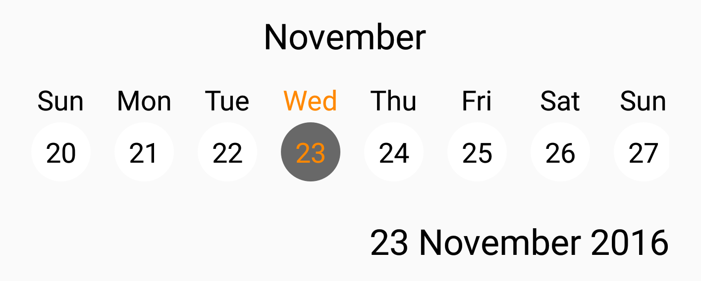
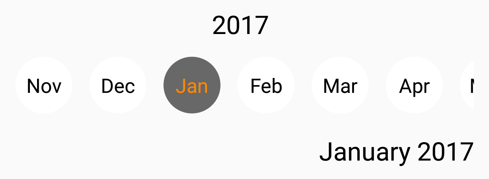

<h1 align="center"> Scroll Date Picker </h1>
<p align="center">
  A custom horizontally scrolling date picker for Android.
</p>
<p align="center">
  
  
  
</p>

---
## Screenshots
<p align="center">
  
  
</p>
## Features
- Easy to use views to implement horizontal scrolling date pickers
- Custom Atributes allow the user to set the style.
- Ability to set start and end dates.
- Simple way to implement date input.

## Installation
Install by adding the library to your module's `build.gradle` file.
``` gradle
compile 'com.github.gastricspark:scrolldatepicker:1.0.1'
```

## Usage
 To include a `ScrollDatePicker` within your application all you have to do is implement it in your layout
 and then get the value on your activity.
 
### Set Up
 Inlcude either `MonthScrollDatePicker` or `DayScrollDatePicker` within your layout.
 ``` 
 <com.harrywhewell.scrolldatepicker.DayScrollDatePicker
    android:id="@+id/day_date_picker"
    android:layout_width="match_parent"
    android:layout_height="wrap_content"
  />
 ```
  Then just treat it like any other view, find it by id. <br>
  ` mPicker = (DayScrollDatePicker) findViewById(R.id.day_picker); ` <br>
  Then once you have an object of it you can set the start date (<b>local date by default</b>)
  and the end date (<b>infinate by default </b>). <br>
  ` mPicker.setStartDate(10, 10, 2010); ` <br>
  ` mPicker.setEndDate(11, 11, 2011); `
  
### Attributes
 You can define some attributes to style the `ScrollDatePicker` ;
 - `baseColor` the default color of the selector
 - `baseTextColor` the default color of the views text
 - `selectedColor` the selected color of the selector
 - `selectedTextColor` the selected text color of the selector
 - `showTitle` if the title should be shown e.g. '2016' (<b>true by defualt</b>)
 - `showFullDate` if the full date should be shown e.g. '28 Feburary 2016' (<b>true by default</b>)
 
### Getting Date
 Getting date from the view is really easy, all you have to do is call `getSelectedDate`
 and then implement the `OnDateSelectedListener`.
 ```
  mPicker.getSelectedDate(new OnDateSelectedListener() {
    @Override
      public void onDateSelected(@Nullable Date date) {
        if(date != null){
          // do something with selected date
        }
      }
    });
 ```
### Sample App
There is a sample application included so that you can see how to implement the Scroll Date Pickers, as well as definie their
attributes and get their values.
